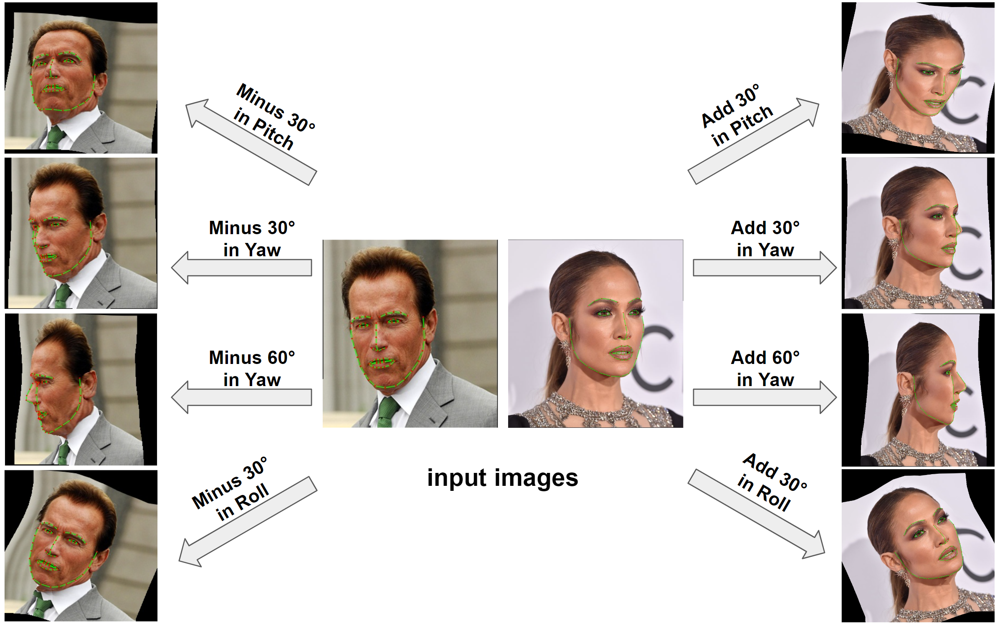

# ibug.face_pose_augmentation
A Python toolbox for face pose augmentation based on [3DDFA](https://ieeexplore.ieee.org/iel7/34/4359286/08122025.pdf) \[1\] and the authors' [original Matlab code](http://www.cbsr.ia.ac.cn/users/xiangyuzhu/projects/3DDFA/main.htm). Comparing to the [Matlab version](http://www.cbsr.ia.ac.cn/users/xiangyuzhu/projects/3DDFA/main.htm), we fixed few bugs and improved the algorithm to get better correspondence between the 2D landmarks on the original image and the landmarks on the warped image. This tool has been used in our previous work on the topic of  pose-invariant lip-reading \[2\]. We kindly request you to cite both \[1\] and \[2\] should you decide to use this tool in your research.

<p align="center">

</p>

## Prerequisites
* [Numpy](https://www.numpy.org/): `$pip3 install numpy`
* [Sciypy](https://www.scipy.org/): `$pip3 install scipy`
* [PyTorch](https://pytorch.org/): `$pip3 install torch torchvision`
* [OpenCV](https://opencv.org/): `$pip3 install opencv-python`
* [cmake](https://cmake.org/): `$pip3 install cmake`
* [igraph](https://igraph.org/python/): `$pip3 install igraph`
* [matplotlib](https://matplotlib.org/): `$pip3 install matplotlib`
* [shapely](https://github.com/Toblerity/Shapely): `$pip3 install shapely`
* [cython](https://cython.org/): `$pip3 install cython`
### Modules needed for test script with webcam
* [ibug.face_detection](https://github.com/hhj1897/face_detection): See this repository for details: [https://github.com/hhj1897/face_detection](https://github.com/hhj1897/face_detection).
* [ibug.face_alignment](https://github.com/hhj1897/face_alignment): See this repository for details: [https://github.com/hhj1897/face_alignment](https://github.com/hhj1897/face_alignment).

## How to Install
```bash
git clone --recurse-submodules https://github.com/hhj1897/face_pose_augmentation.git
cd face_pose_augmentation
pip install -r requirements.txt
pip install -e .
```

## How to Test (using a webcam)
Please install [ibug.face_detection](https://github.com/hhj1897/face_detection) and [ibug.face_alignment](https://github.com/hhj1897/face_alignment) before running this test.

```bash
python face_pose_augmentation_test.py [-i webcam_index]
```

## How to Use

### Augment a folder of images (no face detection box nor facial landmarks is required)
Please install [ibug.face_detection](https://github.com/hhj1897/face_detection) and [ibug.face_alignment](https://github.com/hhj1897/face_alignment) before running this test.

```bash
python face_pose_augmentation_main.py -i "samples/images" -o "samples/outputs" -y -20
```

### Call pose augmentation with 68 landmarks in Python file
```python
from ibug.face_pose_augmentation import TDDFAPredictor, FacePoseAugmentor

# Instantiate 3DDFA
tddfa = TDDFAPredictor(device='cuda:0')

# Create the face pose augmentor
augmentor = FacePoseAugmentor()

# Fit 3DMM to the face specified by the 68 2D landmarks.
tddfa_result = TDDFAPredictor.decode(tddfa(image, landmarks, rgb=False))[0]

# Perform pose augmentation
# Note:
#   1. delta_poses should be a Nx3 array, each row giving the delta pitch,
#      delta yaw, and delta roll of a target pose. This tool should only be
#      used to increase the rotation of face, as it cannot hallucinate
#      occluded texture if being used to frontalised the face.
#   2. landmarks should be a 68x2 array, storing the coordinates of the 68
#      2D landmarks. This is optional. When this argument is set to None,
#      the function will try to infer 2D landmarks from the vertices on the
#      3D mesh.
#   3. This function returns a list of dictionaries, each element storing
#      the warping result at a target pose, including the warped image, the
#      correspondence map, and landmarks in different styles.
augmentation_results = augmentor(image, tddfa_result, delta_poses, landmarks)
```

## References
\[1\] Shiyang Cheng, Pingchuan Ma, Georgios Tzimiropoulos, Stavros Petridis, Adrian Bulat, Jie Shen, and Maja Pantic. "[Towards pose-invariant lip-reading.](https://ieeexplore.ieee.org/stamp/stamp.jsp?arnumber=9054384&casa_token=u2e0sStltTYAAAAA:8zxyy_lpPzI-3A2QMHZUeWBVDJfOCgkiY9KP1kEwFL04noo7CyiJOwDZYQsVXFv5RN_Rs2aS)" In _IEEE International Conference on Acoustics, Speech and Signal Processing (ICASSP 2020)_, pp. 4357-4361.

\[2\] Xiangyu Zhu, Xiaoming Liu, Zhen Lei, and Stan Z. Li. "[Face alignment in full pose range: A 3d total solution.](https://ieeexplore.ieee.org/iel7/34/4359286/08122025.pdf)" _IEEE transactions on pattern analysis and machine intelligence_ 41, no. 1 (2017): 78-92.

\[3\] Jianzhu Guo, Xiangyu Zhu, Yang Yang, Fan Yan, Zhen Lei, and Stan Z. Li. "[Towards Fast, Accurate and Stable 3D Dense Face Alignment.](https://www.ecva.net/papers/eccv_2020/papers_ECCV/papers/123640154.pdf)" in _Proceedings of the European Conference on Computer Vision (ECCV 2020)_, pp. 152-168.

